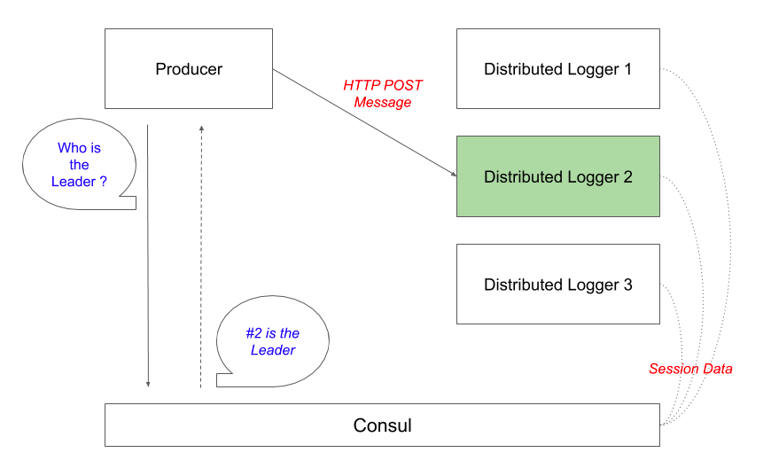

# simpleloggers

这是一个使用`go`+`consul`实现的简易[分布式日志系统](https://github.com/pojiang20/simpleloggers)。
项目结构如下图，`producer`中使用`consul`来发现`Leader`，以此决定将信息发送给谁。`node`中`startApi`响应`http`请求，而使用`consul`来选主。



#### producer
消息发送方，向指定`url`发送请求
```go
func sendMsg(hostname string, msgID int) {
	msg := fmt.Sprintf("Message: %v", msgID)
	log.Printf("Sending message %v\n", msgID)
	resp, err := http.Post(fmt.Sprintf("http://%v:3000/api/v1/log", hostname), "text/plain", strings.NewReader(msg))
	if err != nil {
		log.Printf("http post err: %v", err)
		return
	}

	defer resp.Body.Close()
	_, err = io.ReadAll(resp.Body)
	if resp.StatusCode != 200 {
		log.Printf("status not OK: %v", resp.StatusCode)
		return
	}

	log.Printf("msg sent OK")
}
```
至于发送给谁，是由`consul`决定的
```go
	for {
		//通过consul得知，哪一个是Leader，并向其发送msg
		kv, _, err := client.KV().Get(serviceKey, nil)
		if err != nil {
			log.Fatalf("kv acquire err: %v", err)
		}

		if kv != nil && kv.Session != "" {
			leaderHostname := string(kv.Value)
			sendMsg(leaderHostname, msgID)
			msgID++
		}

		time.Sleep(5 * time.Second)
	}
```
#### node
接收并响应信息
```go
func startAPI() {
	mux := http.NewServeMux()
	mux.HandleFunc("/api/v1/log", func(w http.ResponseWriter, r *http.Request) {
		if !isLeader {
			http.Error(w, "Not Leader", http.StatusBadRequest)
			return
		}

		msg, err := io.ReadAll(r.Body)
		if err != nil {
			http.Error(w, err.Error(), http.StatusInternalServerError)
		}

		log.Printf("Received %v", string(msg))

		w.Write([]byte("OK"))
		if err != nil {
			http.Error(w, err.Error(), http.StatusInternalServerError)
		}
	})

	port := "3000"
	log.Printf("Starting API on port %s ....\n", port)
	log.Fatal(http.ListenAndServe(":"+port, mux))
}
```
至于由谁来响应消息，通过`consul`决定，这里有一个`isLeader`变量来判断该节点是不是`Leader`，不是`Leader`则无法响应`http`。
```go
for {
        if !isLeader {
            acquired, _, err := client.KV().Acquire(acquireKv, nil)
            if err != nil {
                log.Fatalf("kv acquire err: %v", err)
            }

            if acquired {
                isLeader = true
                log.Printf("I'm the leader !\n")
            }
        }

        time.Sleep(time.Duration(ttl/2) * time.Second)
    }
```
参考
[https://didil.medium.com/building-a-simple-distributed-system-with-go-consul-39b08ffc5d2c](https://didil.medium.com/building-a-simple-distributed-system-with-go-consul-39b08ffc5d2c)
